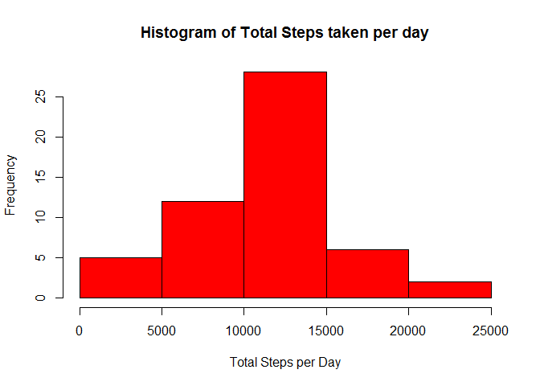
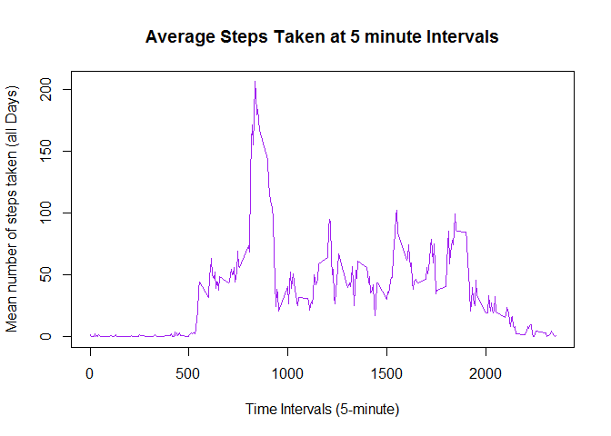

# Reproducible Research: Peer Assessment 1


## Loading and preprocessing the data

1. Load the data (i.e. read.csv())
2. Process/transform the data (if necessary) into a format suitable for your analysis


```r
## Suppose the activity.csv is in the current directory
## Reading data and prinint 1st few rows
stepsdata <- read.csv("activity.csv")
stepsdata$date <- as.Date(stepsdata$date, "%Y-%m-%d")
head(stepsdata)
```

```
##   steps       date interval
## 1    NA 2012-10-01        0
## 2    NA 2012-10-01        5
## 3    NA 2012-10-01       10
## 4    NA 2012-10-01       15
## 5    NA 2012-10-01       20
## 6    NA 2012-10-01       25
```


## What is mean total number of steps taken per day?

1. Calculate the total number of steps taken per day
2. If you do not understand the difference between a histogram and a barplot, research the difference between them. Make a histogram of the total number of steps taken each day
3. Calculate and report the mean and median of the total number of steps taken per day


```r
### Calculating total steps taken per day
totalsteps <- tapply(stepsdata$steps, stepsdata$date,sum)

### Histogram of the total number of steps taken each day
hist(totalsteps,col="red",xlab="Total Steps per Day", 
     ylab="Frequency", main="Histogram of Total Steps taken per day")
```



#### Mean of total number of steps taken per day


```r
mean(totalsteps, na.rm = TRUE)
```

```
## [1] 10766.19
```
#### Median of total number of steps taken per day


```r
median(totalsteps, na.rm = TRUE)
```

```
## [1] 10765
```

## What is the average daily activity pattern?

1. Make a time series plot (i.e. type = "l") of the 5-minute interval (x-axis) and the average number of steps taken, averaged across all days (y-axis)
2. Which 5-minute interval, on average across all the days in the dataset, contains the maximum number of steps?


```r
msteps <- tapply(stepsdata$steps, stepsdata$interval, mean, na.rm = TRUE)
```
#### plot of series of average steps taken at 5 minutes of intervals

```r
plot(row.names(msteps), msteps, type = "l", xlab = "Time Intervals (5-minute)", ylab = "Mean number of steps taken (all Days)", main = "Average Steps Taken at 5 minute Intervals", col = "purple")
```



#### 5-minute interval, on average across all the days in the dataset, contains the maximum number of steps

```r
intervalnumber <- which.max(msteps)
maxintervalsteps <- names(intervalnumber)
maxintervalsteps
```

```
## [1] "835"
```
## Imputing missing values

1. Calculate and report the total number of missing values in the dataset (i.e. the total number of rows with NAs)
2. Devise a strategy for filling in all of the missing values in the dataset. The strategy does not need to be sophisticated. For example, you could use the mean/median for that day, or the mean for that 5-minute interval, etc.
3. Create a new dataset that is equal to the original dataset but with the missing data filled in.
4. Make a histogram of the total number of steps taken each day and Calculate and report the mean and median total number of steps taken per day. Do these values differ from the estimates from the first part of the assignment? What is the impact of imputing missing data on the estimates of the total daily number of steps?

#### Compute the number of NA values in the dataset


```r
numberofNAs <- sum(is.na(stepsdata))
numberofNAs
```

```
## [1] 2304
```

#### Replacing missing values


```r
navalues <- which(is.na(stepsdata))
imputedValues <- msteps[as.character(stepsdata[navalues, 3])]
names(imputedValues) <- navalues
for (i in navalues) {
  stepsdata$steps[i] = imputedValues[as.character(i)]
}
sum(is.na(stepsdata))
```

```
## [1] 0
```
#### Histogram after imputing the missing values

```r
### Calculating total steps taken per day
totalsteps <- tapply(stepsdata$steps, stepsdata$date,sum)

### Histogram of the total number of steps taken each day
hist(totalsteps,col="red",xlab="Total Steps per Day", 
     ylab="Frequency", main="Histogram of Total Steps taken per day")
```


#### Calculating Mean and Median after imputing the missing values


```r
mean(totalsteps)
```

```
## [1] 10766.19
```

```r
median(totalsteps)
```

```
## [1] 10766.19
```


## Are there differences in activity patterns between weekdays and weekends?

1. Create a new factor variable in the dataset with two levels - "weekday" and "weekend" indicating whether a given date is a weekday or weekend day.
2. Make a panel plot containing a time series plot (i.e. type = "l") of the 5-minute interval (x-axis) and the average number of steps taken, averaged across all weekday days or weekend days (y-axis). See the README file in the GitHub repository to see an example of what this plot should look like using simulated data.


```r
days <- weekdays(stepsdata$date)

stepsdata$day_type <- ifelse(days == "Saturday" | days == "Sunday", "Weekend", "Weekday")
```

#### Displaying sample data with weekend and weekday 

```r
head(stepsdata)
```

```
##       steps       date interval day_type
## 1 1.7169811 2012-10-01        0  Weekday
## 2 0.3396226 2012-10-01        5  Weekday
## 3 0.1320755 2012-10-01       10  Weekday
## 4 0.1509434 2012-10-01       15  Weekday
## 5 0.0754717 2012-10-01       20  Weekday
## 6 2.0943396 2012-10-01       25  Weekday
```

#### Creating a panel plot


```r
msteps <- aggregate(stepsdata$steps, by = list(stepsdata$interval, stepsdata$day_type), mean)
names(msteps) <- c("interval", "day_type", "steps")
xyplot(steps ~ interval | day_type, msteps, type = "l", layout = c(1, 2), xlab = "Interval", ylab = "Number of steps")
```


